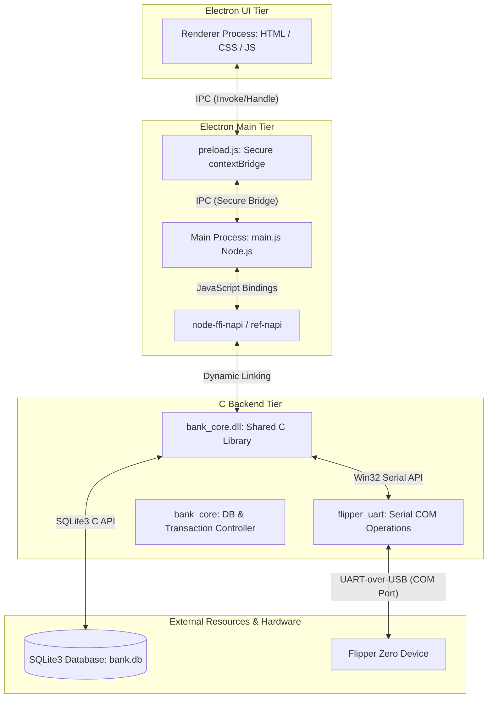

# Technical Specification: Flipper Bank Terminal

This document details the system architecture, component interfaces, data structures, serial port communication details, and database schema for the "Flipper Bank" Desktop Terminal.

---

## 1. System Architecture

The Flipper Bank application is a desktop bank terminal that reads card information from a Flipper Zero device via a serial (UART) interface and interacts with a local SQLite database for bank account queries and transactions.

The architecture is divided into three tiers:



### 1.1 Electron UI Tier
* **Technology**: HTML5, Vanilla CSS3 (Terminal Pixel Art Theme), and Javascript.
* **Role**: Provides a modern, responsive, retro-themed, visual-terminal dashboard. Displays card scan actions, balance enquiries, and transaction prompts.
* **Security**: Isolated from Node.js APIs directly. Uses IPC channels exposed via a secure preload script.

### 1.2 Electron Main Tier
* **Technology**: Node.js, Electron Main Process, `node-ffi-napi`, `ref-napi`.
* **Role**: Manages the application window lifecycle, catches IPC calls from the UI, maps Node-to-C types using `ref-napi`, and dynamically links `bank_core.dll` via `ffi-napi` to invoke performance-critical operations.

### 1.3 C Core DLL Tier
* **Technology**: Pure C (C99, compiled with MinGW GCC on Windows), Win32 API for File I/O (serial communication), and SQLite3 (amalgamated source).
* **Role**: Exposes a clean C API containing core database access logic and native Windows serial port configuration interfaces to read RFID-emulated or serial-sent tokens from Flipper Zero.

---

## 2. UART Serial Configuration

The application communicates with Flipper Zero over a Virtual COM Port (UART over USB) using the Windows Win32 API. 

### 2.1 Connection Settings
To maintain synchronization and prevent transmission loss, the following COM port settings must be configured on the host machine:

| Parameter | Configuration Value | Win32 DCB Member |
|---|---|---|
| **Baud Rate** | 115200 bps | `BaudRate = CBR_115200` |
| **Byte Size** | 8 Bits | `ByteSize = 8` |
| **Parity** | None | `Parity = NOPARITY` |
| **Stop Bits** | 1 Stop Bit | `StopBits = ONESTOPBIT` |
| **Flow Control**| None (No Hardware/Software) | `fOutxCtsFlow = FALSE`, `fRtsControl = RTS_CONTROL_DISABLE` |

### 2.2 Win32 COM Port API Lifecycle
1. **Open Connection**: Use `CreateFileA` with `GENERIC_READ | GENERIC_WRITE`, `0` sharing, and `OPEN_EXISTING` flags.
2. **Retrieve Settings**: Call `GetCommState` to fetch the default Device Control Block (`DCB`) structure.
3. **Apply Settings**: Modify `DCB` parameters to match the configuration table and call `SetCommState`.
4. **Timeouts**: Define strict read/write timeouts using `COMMTIMEOUTS` (via `SetCommTimeouts`) to avoid blocking Electron main thread executions indefinitely.
5. **Read/Write Operations**: Call `ReadFile` and `WriteFile` synchronously inside the C DLL.
6. **Release Connection**: Close the connection handle using `CloseHandle`.

---

## 3. Database Schema

Persistence is managed directly inside the C library using an embedded **SQLite3** engine. The schema consists of two tables: `accounts` and `transactions`.

```sql
-- Core accounts details table
CREATE TABLE IF NOT EXISTS accounts (
    card_id TEXT PRIMARY KEY,
    holder_name TEXT NOT NULL,
    balance REAL NOT NULL DEFAULT 0.0,
    is_active INTEGER NOT NULL DEFAULT 1 CHECK (is_active IN (0, 1))
);

-- Transaction history table (Audit logs)
CREATE TABLE IF NOT EXISTS transactions (
    transaction_id INTEGER PRIMARY KEY AUTOINCREMENT,
    from_card_id TEXT,
    to_card_id TEXT,
    amount REAL NOT NULL,
    timestamp DATETIME DEFAULT CURRENT_TIMESTAMP,
    FOREIGN KEY (from_card_id) REFERENCES accounts(card_id),
    FOREIGN KEY (to_card_id) REFERENCES accounts(card_id)
);
```

---

## 4. C Structures and Interface APIs

### 4.1 Data Structures

```c
#pragma pack(push, 1)

// Account representation structure mapped into Electron FFI
typedef struct {
    char card_id[64];        // Unique hardware token/ID read from Flipper Zero
    char holder_name[128];   // Account owner name
    double balance;          // Account balance in standard currency
    int is_active;           // Boolean flag (1 = Active, 0 = Suspended)
} Account;

#pragma pack(pop)
```